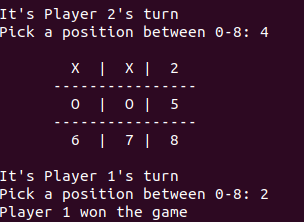

# Microverse_Tic_tac_toe
# Project Name

This is a project built when studying at Microverse. The goal of this project is
to use what we have been learning on ruby curriculum.

This is a simple TicTacToe game. This project was built using the programming
language ruby. We had to put to use what we have been learning and all the new
concepts that makes ruby an objected oriented programming language. Our project
was built using OOP concepts. We followed git flow in all the phases of the project.

## Built With

- Programming Language: Ruby
- Version Control System: Git, Github

## Getting Started
To play the game the user will need to have ruby installed in his computer.
When inside of the folder Microverse_Tic_tac_toe you can run the command ruby /bin/main.rb
to execute the main file inside bin folder.

To get a local copy up and running follow these simple example steps.

### Prerequisites
ruby above version 2.4 (Other versions probably will work just fine, but it's not recommended)

### Setup
To clone this project using ssh: git clone git@github.com:RichardBongani/Microverse_Tic_tac_toe.git
To clone this project using https: git clone https://github.com/RichardBongani/Microverse_Tic_tac_toe.git

### Install
After you download the project you have everything you need to run the game.

### Usage
When inside of the folder Microverse_Tic_tac_toe you can run the command ruby /bin/main.rb

Name of Game: Tic Tac Toe

Game rules: This game is designed to be played by two people i.e Player_1 and Player_2 : For winning conditions player has to match the following cells but not limited to only the ones shown:

WIN: if player the same player symbol matches any column, row or diagonal, then player wins.

DRAW: If the board of the game is full and there is no win then it is a Draw (no one wins).see picture above.
Game termination : The game will only terminate if any player wins or if players draw
Players can only use the assigned symbols X or O. If players use any other symbols the game will prompt the player to pick a valid symbol.
Player_1 one will start playing and then alternate with Player_2

## Authors

**Author1**
  Richard Phala
- Github: [@githubhandle](https://github.com/RichardBongani)
- Twitter: [@twitterhandle](https://github.com/Richard15391169)
- Linkedin: [linkedin](https://www.linkedin.com/in/richard-phala-078428113/)

**Author2**
  Eduardo dos Reis Alvarenga
- Github: [@githubhandle](https://github.com/eduardoreisalvarenga)
- Twitter: [@twitterhandle](https://www.linkedin.com/in/eduardo-alvarenga-44204818a/)
- Linkedin: [linkedin](https://www.linkedin.com/in/eduardo-alvarenga-44204818a/)

## License
This project is [MIT](lic.url) licensed.
