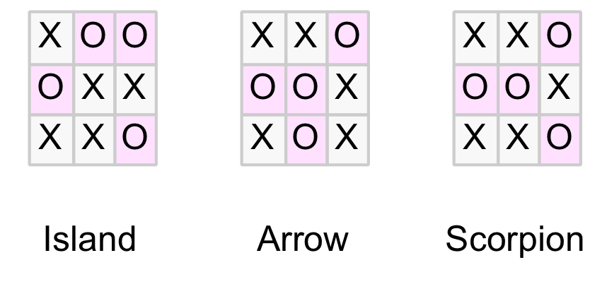

# Microverse_Tic_tac_toe

#Game Description:
Name of Game: Tic Tac Toe

Game rules: This game is designed to be played by two people i.e Player_1 and Player_2 : For winning conditions player has to match the following cells but not limited to only the ones shown:

WIN: if player the same player symbol matches any column, row or diagonal, then player wins.

DRAW: If the board of the game is full and there is no win then it is a Draw (no one wins).see picture above.
Game termination : The game will only terminate if any player wins or if players draw
Players can only use the assinged symbols X or O. If players use any other symbols the game will prompt the player to pick a valid symbol.
Player_1 one will start playing and then alternate with Player_2
